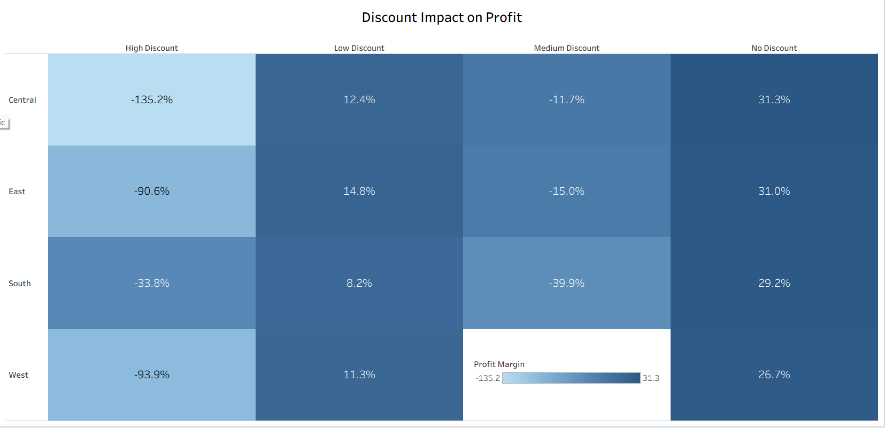
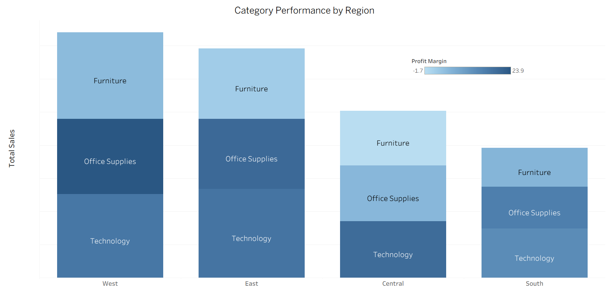
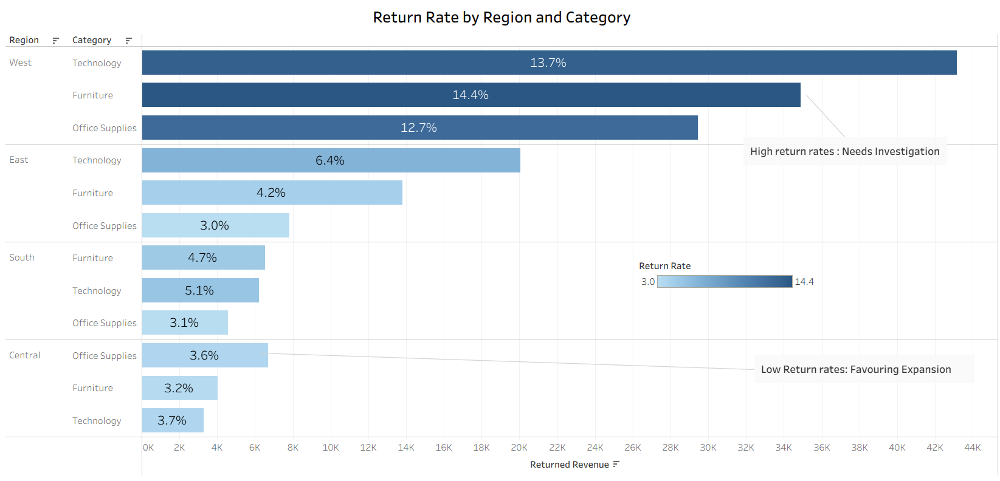

# Market Expansion  Analysis — Retail Superstore

**Analytics Requirement Document (ARD)**
Defines the business problem, stakeholder questions, and initial analysis guiding this project.  
[View ARD](https://docs.google.com/spreadsheets/d/1PDW0-wBs-FDuXeIbUjCwdjpPBzmyh_QR-bLaqgpOAmE/edit?usp=sharing)

**Tableau Dashboard:** 
Interactive visualization of demand, profitability, and return trends across regions to support the market expansion decision.  
[View Dashboard](https://public.tableau.com/views/market_expansion/Dashboard6?:language=en-US&publish=yes&:sid=&:redirect=auth&:display_count=n&:origin=viz_share_link)

# Project Background

Nexus Retail is a fictional retail superstore operating across the **United States and Canada**, selling products across multiple **regions and categories including Technology, Office Supplies, and Furniture**.

Leadership wants to determine **which single region should be prioritized for expansion next year**. The decision should be based on a combination of **customer demand, profitability, discount dependency, and category performance**.

# Dataset & Initial Checks

Dataset Used : Superstore Sales , 
You can Access it from : https://public.tableau.com/app/learn/sample-data

The dataset used for this analysis contains **order-level transaction data and product return information**.

The database structure consists of **two tables**:

**Orders Table**

- Contains order-level data including region, category, sales, discount, quantity, and profit.

**Returns Table**

- Contains records indicating whether an order was returned.

Both tables are connected using **order_id**, enabling return rate analysis across regions and product categories.

Initial data validation checks were performed before analysis:

- **Duplicate checks:** Identified and removed **2 exact duplicate rows** to avoid double counting.
- **Missing value checks:** Verified key fields such as sales, profit, quantity, and region contained no missing values.
- **Logical validation:** Confirmed quantity values were positive and discount values were within the valid range.
- **Outlier checks:** Reviewed extreme values in sales, profit, and quantity to ensure they represent valid transactions.

# Executive Summary

### Overview of Findings

West and East currently generate the highest demand, contributing the largest share of total sales and order volume. However, these markets appear relatively mature.

The **Central region shows solid demand potential but significantly lower profit margins (~8%) compared to ~15% in West and East**, largely driven by heavy discounting.

Category analysis shows **Technology generating the strongest performance with high sales and margins**, while **Furniture struggles with profitability in Central (~-1% margin)** and shows higher return rates in some regions.

Considering demand potential, profitability improvement opportunities, and category performance, **Central emerges as the most suitable region for expansion once discount strategy is optimized**.

# Insights Deep Dive

### Demand Analysis

- **West and East generate the highest sales**, indicating the strongest customer demand in the dataset.
- These regions also show the **highest order volumes**, suggesting that the revenue difference is mainly driven by the number of orders rather than larger order sizes.
- **Average Order Value (AOV) remains relatively consistent across regions**, which further supports the idea that demand differences come from order frequency.
- The **Central region still shows healthy demand levels**, with solid sales and order volume, making it a strong candidate for expansion.

### Profitability Analysis

- While Central generates strong revenue, it shows the **lowest profit margins (~8%)**, which is significantly lower than **West and East (~15%)**.
- This suggests that **Central is generating sales but struggling to convert those sales into profit**.
- One likely explanation is **aggressive discounting or pricing inefficiencies** in that region.
- Improving margins in Central could unlock significant profitability if expansion occurs.

### Discount Strategy Analysis

- **High and medium discount levels often lead to negative profit margins**, indicating that heavy discounting is eroding profitability.
- Most profitable transactions occur when **low or no discounts are applied**.
- This pattern appears **consistent across regions**, suggesting that discounting strategy may be too aggressive overall.
- Reducing high discount usage, especially in **Central**, could significantly improve margins.

### Category Performance

- **Technology performs the strongest across all regions**, combining high sales with strong profit margins.
- **Office Supplies generates stable revenue and consistent margins**, although margins in **Central (~5%) are noticeably lower than in other regions**.
- **Furniture shows weak profitability overall**, with **Central experiencing negative margins (~-1.7%)**, indicating potential pricing or cost issues.

### Return Performance

- The **West region shows the highest return rates across all categories**, with total returned revenue of **$107,483 (~4.6% of total revenue)**.
- Although higher than other regions, this return rate still remains within a **reasonable range for retail operations**.
- The **Central region has the lowest return rates across categories**, which further supports its potential as an expansion candidate.

# Final Recommendation

Based on the combined analysis of demand, profitability, discount strategy, and category performance:

- **Central region appears to be the most promising candidate for expansion**, as it shows solid demand and relatively low return rates.
- However, **profit margins should be improved before scaling**, primarily by reducing heavy discounting.
- Expansion efforts should focus primarily on **Technology products**, followed by **Office Supplies**, which both show strong and stable performance.
- **Furniture expansion should be approached cautiously** until margin issues are better understood.

# Assumptions and Caveats

Several assumptions were made during the analysis:

- Profit margin was calculated as **Profit / Sales**.
- Discount levels were grouped into **No, Low, Medium, and High categories** for analysis.
- Return rates were calculated by joining the Orders and Returns tables using **order_id**.
- The dataset represents historical transactional data and does not account for external factors such as market competition or seasonality.
